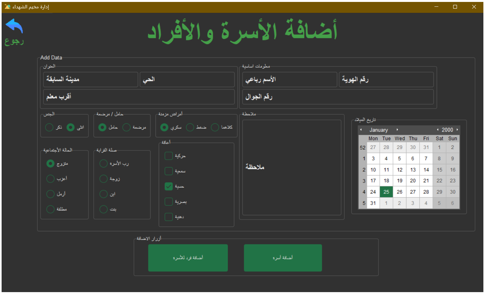

    
    <h1 align="center" style="margin: 0 auto 0 auto;">Camp Martyrs</h1>

 
 

## Translations
- ## [عربي](README.md)

   

************
 

##  **Martyrs Camp Management** 

**Introduction:**
The "Martyrs Camp" program was established in response to the evolving circumstances following the war in the Gaza Strip. It arose from the suffering experienced by the Palestinian people during this period of conflict. The primary aim of the program is to manage camps and register displaced families in the Gaza Strip, encompassing several key sections.

**Program Sections:**

1. **Adding a Family to the Database:**
   In this section, details such as the family's address, contact number, and ID number are recorded. Additional family members can be added, including their names, ID numbers, contact numbers, gender, marital status, relationship to the head of the family, date of birth, any disabilities, chronic illnesses, maternal status, and other relevant notes.

2. **Editing Data for Families and Individuals:**
   This section allows for the editing of all fields in the database pertaining to families or individuals.

3. **Deleting Families or Individuals:**
   Families or individuals can be removed from the database in the event of marriage, martyrdom of a family member, or if the family relocates to another camp.

4. **Search Functionality:**
   The program includes various search capabilities, such as:
   - Searching for families and displaying data upon requests from institutions or associations.
   - Identifying families with pregnant or breastfeeding members.
   - Finding families with members who have disabilities or chronic diseases.
   - Searching for specific families or members by age.
   The results can be exported as an Excel file.

**Technical Features of the Program:**

The program is developed using Python programming concepts and includes:
- Efficient data and variable management.
- Improved organization and readability of data.
- Data validation processes.
- Implementation of Object-Oriented Programming and Design Patterns in a simplified manner.
- Modern class-based design for the program interfaces.

**Future Development:**
Future enhancements may include linking the program to a website and incorporating application programming interfaces (APIs) for communication with institutions and associations. Additionally, a table could be added to the database to document information about families that have received food parcels.

Overall, this program aims to enhance camp management and streamline operations related to displaced families in the Gaza Strip.

## 📐 How it Works

  <a href="media/addfp.mp4">🎥 Video</a>

************
## 💻 Image

