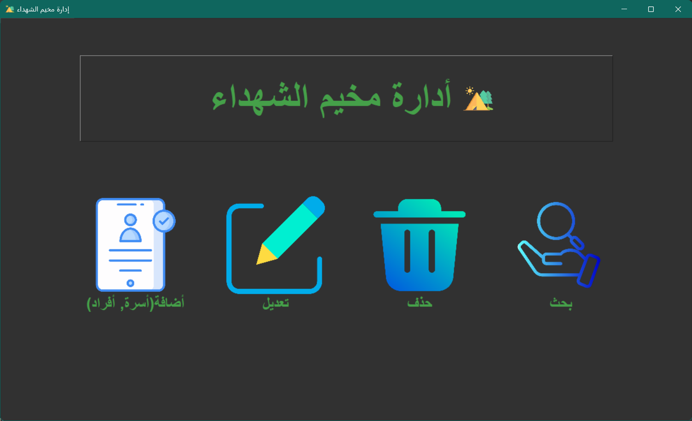
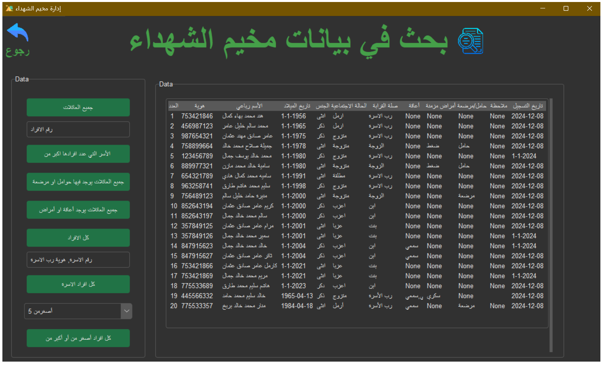
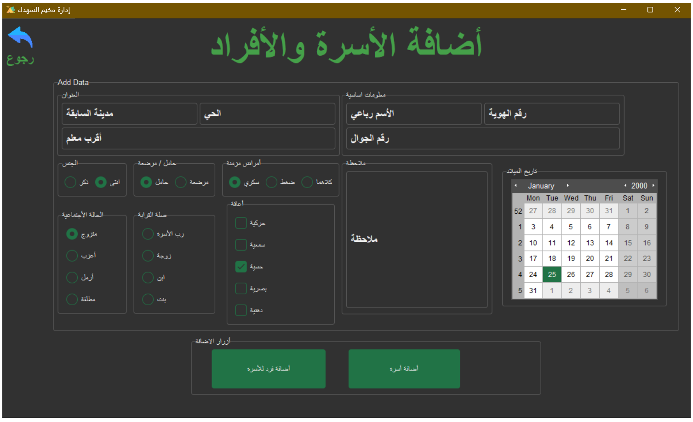
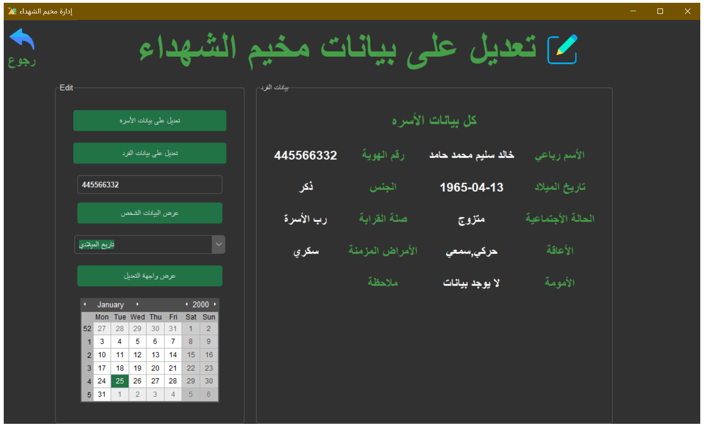
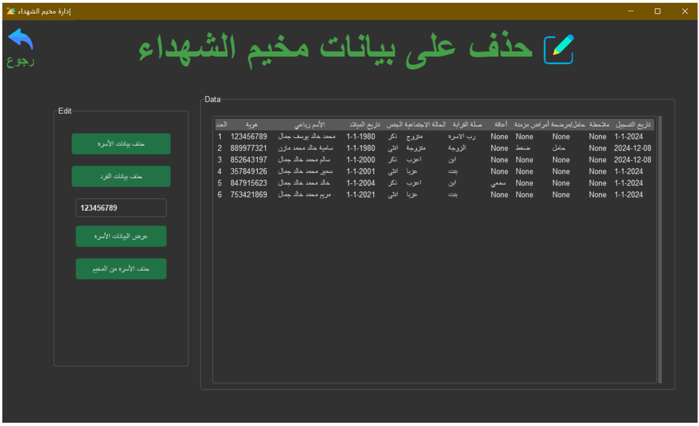

    
    <h1 align="center" style="margin: 0 auto 0 auto;">Camp Martyrs</h1>

 
 

[//]: # (
)

[//]: # ()

[//]: # (
)

## Translations
- [English](README.en-EN.md)

 

************

 

## **إدارة مخيم الشهداء** 

**مقدمة:**

تم إنشاء برنامج "مخيم الشهداء" استجابة للظروف المتطورة التي أعقبت الحرب في قطاع غزة. وقد نشأ البرنامج من المعاناة التي عاشها الشعب الفلسطيني خلال هذه الفترة من الصراع. والهدف الأساسي من البرنامج هو إدارة المخيمات وتسجيل الأسر النازحة في قطاع غزة، ويشمل عدة أقسام رئيسية.

**أقسام البرنامج:**

<ol>
<li><strong>إضافة أسرة إلى قاعدة البيانات:</strong>
    
في هذا القسم، يتم تسجيل تفاصيل مثل عنوان الأسرة ورقم الاتصال ورقم الهوية. ويمكن إضافة أفراد أسرة إضافيين، بما في ذلك أسمائهم وأرقام الهوية وأرقام الاتصال والجنس والحالة الاجتماعية والعلاقة برب الأسرة وتاريخ الميلاد وأي إعاقات وأمراض مزمنة وحالة الأم والملاحظات الأخرى ذات الصلة.

   
</li>
<li><strong>تحرير البيانات للأسر والأفراد:</strong>
    
يسمح هذا القسم بتحرير جميع الحقول في قاعدة البيانات المتعلقة بالأسر أو الأفراد.

</li>
<li><strong>حذف العائلات أو الأفراد:</strong>
    
يمكن حذف العائلات أو الأفراد من قاعدة البيانات في  حالة الزواج أو استشهاد أحد أفراد العائلة أو انتقال العائلة إلى معسكر آخر:

   
</li>
</ol>

[//]: # ()
[//]: # (1. **إضافة أسرة إلى قاعدة البيانات**:  في هذا القسم، يتم تسجيل تفاصيل مثل عنوان الأسرة ورقم الاتصال ورقم الهوية. ويمكن إضافة أفراد أسرة إضافيين، بما في ذلك أسمائهم وأرقام الهوية وأرقام الاتصال والجنس والحالة الاجتماعية والعلاقة برب الأسرة وتاريخ الميلاد وأي إعاقات وأمراض مزمنة وحالة الأم والملاحظات الأخرى ذات الصلة.)

[//]: # ()
[//]: # (1. **تحرير البيانات للأسر والأفراد** : يسمح هذا القسم بتحرير جميع الحقول في قاعدة البيانات المتعلقة بالأسر أو الأفراد.)

[//]: # ()
[//]: # (1. **حذف العائلات أو الأفراد** :   يمكن حذف العائلات أو الأفراد من قاعدة البيانات في حالة الزواج أو استشهاد أحد أفراد العائلة أو انتقال العائلة إلى معسكر آخر.)

[//]: # ()

**وظيفة البحث:**

يتضمن البرنامج إمكانيات بحث متنوعة، مثل:
- البحث عن العائلات وعرض البيانات عند طلبها من المؤسسات أو الجمعيات.
- تحديد العائلات التي لديها أفراد حوامل أو مرضعات.
- إيجاد العائلات التي لديها أفراد يعانون من إعاقات أو أمراض مزمنة.
- البحث عن عائلات أو أفراد محددين حسب العمر.

يمكن تصدير النتائج كملف إكسل.

**الميزات التقنية للبرنامج:**

تم تطوير البرنامج باستخدام مفاهيم برمجة بايثون ويتضمن:
- إدارة فعالة للبيانات والمتغيرات.
- تحسين تنظيم البيانات وقابليتها للقراءة.
- عمليات التحقق من صحة البيانات.
- تنفيذ البرمجة الموجهة للكائنات وأنماط التصميم بطريقة مبسطة.
- تصميم حديث قائم على الفئات لواجهات البرنامج.

**التطويرات المستقبلية:**

قد تشمل التحسينات المستقبلية ربط البرنامج بموقع إلكتروني ودمج واجهات برمجة التطبيقات (APIs) للتواصل مع المؤسسات والجمعيات. بالإضافة إلى ذلك، يمكن إضافة جدول إلى قاعدة البيانات لتوثيق المعلومات حول الأسر التي تلقت طرودًا غذائية.

يهدف هذا البرنامج بشكل عام إلى تحسين إدارة المخيمات وتبسيط العمليات المتعلقة بالأسر النازحة في قطاع غزة.

***********

## 📐 How it Works
<video width="3000" height="460" controls autoplay>
  <source src="media/addfp.mp4" type="video/mp4">
  المتصفح الخاص بك لا يدعم تشغيل الفيديو.
</video>

************
## 💻 Image

**************

[//]: # ()
[//]: # (************)

[//]: # (
)

[//]: # (<iframe width="560" height="315" src="media/addfp.mkv" frameborder="0" allowfullscreen></iframe>)

[//]: # ()
[//]: # (
)

[//]: # ()
[//]: # (***************)

[//]: # ()
[//]: # ([sss]&#40;media/addfp.mkv&#41;)

[//]: # ()
[//]: # ()
[//]: # (**************)

[//]: # ()
[//]: # (<video width="640" height="360" controls autoplay>)

[//]: # (  <source src="media/addfp.mp4" type="video/mp4">)

[//]: # (  المتصفح الخاص بك لا يدعم تشغيل الفيديو.)

[//]: # (</video>)

[//]: # ()
[//]: # ()
[//]: # (**********)

[//]: # ()
[//]: # (<video width="640" height="360" controls>)

[//]: # (  <source src="./media/addfp.mkv" type="video/mkv">)

[//]: # (  المتصفح الخاص بك لا يدعم تشغيل الفيديو.)

[//]: # (</video>)

[//]: # ()
[//]: # ()
[//]: # ()
[//]: # (*************)